# 🔒 GitHub Branch Protection Setup Guide

**Protect the `develop` branch with required CI/CD checks**

---

## 🎯 Goal

Ensure that **no code can be merged to `develop` without passing all CI/CD checks**.

---

## ⚡ Quick Setup (5 Minutes)

### Step 1: Push CI/CD Workflow

```bash
# Make sure you're in the project root
cd /Users/hamad/Projects/fisal

# Add the workflow file
git add .github/workflows/develop-checks.yml

# Commit
git commit -m "ci: add CI/CD workflow for develop branch"

# Push to main/master first (or your default branch)
git push origin main
```

---

### Step 2: Enable Branch Protection

1. **Go to GitHub repository**
   - Navigate to: `https://github.com/YOUR_ORG/fisal`

2. **Open Settings**
   - Click `Settings` tab
   - Click `Branches` in left sidebar

3. **Add Branch Protection Rule**
   - Click `Add rule` or `Add branch protection rule`

4. **Configure Protection for `develop`:**

   **Branch name pattern:** `develop`

   **Enable these settings:**

   ✅ **Require a pull request before merging**
   - ✅ Require approvals: `1` (or more)
   - ✅ Dismiss stale pull request approvals when new commits are pushed
   - ✅ Require review from Code Owners (optional)

   ✅ **Require status checks to pass before merging**
   - ✅ Require branches to be up to date before merging
   - **Add these required checks:**
     - `Code Quality & Validation`
     - `Run Tests`
     - `Build Check`
     - `Security Audit`

   ✅ **Require conversation resolution before merging**

   ✅ **Do not allow bypassing the above settings**
   - Uncheck "Allow administrators to bypass"

5. **Click `Create` or `Save changes`**

---

## 📋 Complete Settings Checklist

### Branch Protection Rules for `develop`

```
Branch name pattern: develop

☑️ Require a pull request before merging
   ☑️ Required approvals: 1
   ☑️ Dismiss stale pull request approvals
   ☑️ Require review from Code Owners
   ☐ Restrict who can dismiss pull request reviews
   ☐ Allow specified actors to bypass required pull requests

☑️ Require status checks to pass before merging
   ☑️ Require branches to be up to date before merging
   
   Required checks (add these):
   ☑️ Code Quality & Validation
   ☑️ Run Tests  
   ☑️ Build Check
   ☑️ Security Audit

☑️ Require conversation resolution before merging

☑️ Require signed commits (optional, but recommended)

☑️ Require linear history (optional)

☑️ Do not allow bypassing the above settings
   ☐ Allow fork syncing
   ☑️ Lock branch (optional - prevents any pushes)

☐ Restrict who can push to matching branches
```

---

## 🔍 How to Add Required Status Checks

**Important:** GitHub only shows checks that have run at least once!

### Method 1: After First PR

1. Create a test PR to `develop`
2. Wait for CI/CD to run
3. Go back to branch protection settings
4. The checks will now appear in the dropdown
5. Select them as required

### Method 2: Use Check Names

Add these exact names (from the workflow file):

```yaml
- code-quality     # Shows as "Code Quality & Validation"
- test            # Shows as "Run Tests"
- build           # Shows as "Build Check"
- security        # Shows as "Security Audit"
```

---

## 🚀 Push Everything to GitHub

```bash
cd /Users/hamad/Projects/fisal

# Add all CI/CD files
git add .github/workflows/develop-checks.yml
git add .github/BRANCH_PROTECTION_SETUP.md
git add .husky/pre-commit
git add .husky/pre-push
git add frontend/eetmad/scripts/
git add CI_CD_SUMMARY.md
git add QUICK_SETUP.md

# Commit
git commit -m "ci: add comprehensive CI/CD setup

- Add GitHub Actions workflow for develop branch
- Add pre-commit and pre-push hooks
- Add branch protection setup guide
- Add complete documentation"

# Push to your main branch
git push origin main

# Create develop branch if it doesn't exist
git checkout -b develop
git push origin develop
```

---

## 🧪 Test the Setup

### Test 1: Create a Test PR

```bash
# Create a feature branch
git checkout -b test/ci-cd-check

# Make a small change
echo "// test" >> frontend/eetmad/src/test.ts

# Commit and push
git add .
git commit -m "test: CI/CD workflow"
git push origin test/ci-cd-check
```

**On GitHub:**
1. Create PR from `test/ci-cd-check` → `develop`
2. Watch the CI/CD checks run automatically
3. Checks should appear with status

---

### Test 2: Try to Merge Without Passing

1. Create a PR with failing code
2. Try to merge
3. Should see: "Merging is blocked" ✅

---

### Test 3: Verify Branch Protection

1. Try to push directly to develop:
   ```bash
   git checkout develop
   git push origin develop
   ```
2. Should be blocked if protection is on ✅

---

## 📊 What Happens After Setup

### PR Workflow

```mermaid
graph TD
    A[Create PR to develop] --> B[CI/CD Runs Automatically]
    B --> C{All Checks Pass?}
    C -->|Yes| D[Green Checkmarks ✅]
    C -->|No| E[Red X Marks ❌]
    D --> F{Reviews Approved?}
    E --> G[Fix Issues]
    G --> B
    F -->|Yes| H[Merge Button Enabled]
    F -->|No| I[Request Review]
    I --> F
    H --> J[Can Merge to develop ✅]
```



---

## 🎯 Benefits

### Before Branch Protection:
- ❌ Anyone can push to develop
- ❌ No required reviews
- ❌ No automated checks
- ❌ Bugs slip through

### After Branch Protection:
- ✅ Only through PRs
- ✅ Required reviews
- ✅ Must pass all CI/CD checks
- ✅ High quality code only

---

## 📝 Pull Request Template

A template is included at `.github/pull_request_template.md` to guide developers.

---

## 🔧 Advanced Settings (Optional)

### Code Owners

Create `.github/CODEOWNERS`:

```
# Default owners for everything
*       @your-username @team-lead

# Frontend specific
/frontend/eetmad/    @frontend-team

# CI/CD files
/.github/            @devops-team
```

---

### Required Reviews by Code Owners

In branch protection settings:
- ✅ Require review from Code Owners

---

### Restrict Push Access

**Who can push to develop:**
- Restrict to: Teams or users

**Add teams:**
- Senior developers
- Team leads
- DevOps team

---

## 🚨 Emergency Procedures

### Hotfix Process

If you need to bypass for emergencies:

1. **Option 1: Temporary disable protection**
   - Settings → Branches → Edit rule
   - Temporarily disable
   - Merge hotfix
   - Re-enable immediately

2. **Option 2: Admin override** (if allowed)
   - Admins can merge with failing checks
   - Document why in PR

3. **Option 3: Fast-track PR**
   - Create PR
   - Get fast review
   - Wait for CI/CD (usually < 10 min)
   - Merge

**Always prefer Option 3!**

---

## 📊 Monitoring

### Check CI/CD Status

**Via GitHub UI:**
- Go to `Actions` tab
- See all workflow runs
- Click any run for details

**Via PR:**
- See status checks in PR
- Click "Details" for logs

**Via Commit:**
- Each commit shows check status
- Green ✅ = passed
- Red ❌ = failed

---

## 🐛 Troubleshooting

### Issue: Can't see status checks in settings

**Solution:** Status checks only appear after they've run once.

1. Create a test PR
2. Let CI/CD run
3. Go back to settings
4. Checks will now be available

---

### Issue: Merge button disabled

**Reasons:**
- ❌ CI/CD checks failing
- ❌ Reviews not approved
- ❌ Conversations not resolved
- ❌ Branch not up to date

**Solution:** Fix the blocking issue shown

---

### Issue: Can't push to develop

**This is correct!** Branch is protected.

**Solution:** Create a PR instead:
```bash
git checkout -b feature/my-feature
# make changes
git push origin feature/my-feature
# Create PR on GitHub
```

---

## ✅ Verification Checklist

After setup, verify:

- [ ] Workflow file pushed to GitHub
- [ ] Workflow appears in Actions tab
- [ ] Branch protection rules created for `develop`
- [ ] Required status checks configured
- [ ] Required approvals set (minimum 1)
- [ ] Test PR created
- [ ] CI/CD runs automatically on test PR
- [ ] Can see status checks in PR
- [ ] Cannot merge without passing checks
- [ ] Cannot push directly to develop

---

## 📚 Additional Resources

### GitHub Documentation
- [About branch protection](https://docs.github.com/en/repositories/configuring-branches-and-merges-in-your-repository/defining-the-mergeability-of-pull-requests/about-protected-branches)
- [Managing branch protection rules](https://docs.github.com/en/repositories/configuring-branches-and-merges-in-your-repository/defining-the-mergeability-of-pull-requests/managing-a-branch-protection-rule)
- [About status checks](https://docs.github.com/en/pull-requests/collaborating-with-pull-requests/collaborating-on-repositories-with-code-quality-features/about-status-checks)

### Project Documentation
- [CI/CD Summary](../CI_CD_SUMMARY.md)
- [Quick Setup](../QUICK_SETUP.md)
- [Workflow File](./workflows/develop-checks.yml)

---

## 🎉 Summary

After following this guide:

✅ **CI/CD workflow** pushed to GitHub  
✅ **Branch protection** enabled for develop  
✅ **Required checks** configured  
✅ **Required reviews** enforced  
✅ **No direct pushes** to develop  
✅ **Only quality code** can be merged  

**Your develop branch is now fully protected!** 🛡️

---

*Last Updated: November 15, 2025*
*Maintainer: Fisal Dev Team*

