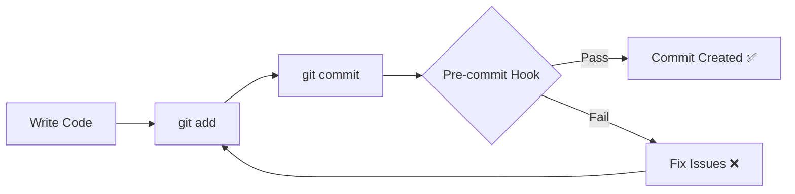

# ⚡ Design Validation - Quick Setup

**Ensure design rules are validated before every commit**

---

## ✅ Pre-commit Hook is Active!

The pre-commit hook is already set up and will automatically run **before every commit**.

---

## 🎯 What It Does

### Before Every Commit:

```
$ git commit -m "your message"

🔍 Running design validation before commit...

━━━━━━━━━━━━━━━━━━━━━━━━━━━━━━━━━━━━━━━━━━━━━━━━━━━━━━━━━━━━
📋 Validating Staged Files
━━━━━━━━━━━━━━━━━━━━━━━━━━━━━━━━━━━━━━━━━━━━━━━━━━━━━━━━━━━━

Files to validate:
  ✓ src/components/MyComponent.tsx

🔍 Running design rules validation...

✅ All staged files pass design rules validation!
━━━━━━━━━━━━━━━━━━━━━━━━━━━━━━━━━━━━━━━━━━━━━━━━━━━━━━━━━━━━
```

**Only clean code gets committed!** ✅

---

## 🧪 Test It Now

```bash
# 1. Make a test change
cd frontend/eetmad
echo "// test" >> src/test-file.ts

# 2. Stage it
git add src/test-file.ts

# 3. Try to commit
git commit -m "test: pre-commit hook"

# You'll see the validation running!
```

---

## 📋 What Gets Checked

The pre-commit hook validates:

- ✅ **Theme System** - No hardcoded colors
- ✅ **i18n** - No hardcoded text
- ✅ **Component Structure** - Proper naming and structure
- ✅ **RTL Support** - Use ms-/me- not ml-/mr-
- ✅ **Animations** - Use framer-motion
- ✅ **Styling** - Use cssVars for colors

**Only staged files** are checked (fast!)

---

## 🔧 How It Works



---

## ❌ If Validation Fails

**Example failure:**

```
❌ Design rules validation failed!
━━━━━━━━━━━━━━━━━━━━━━━━━━━━━━━━━━━━━━━━━━━━━━━━━━━━━━━━━━━━

💡 Quick fixes:
  • Check: scripts/quick-reference/common-fixes.md
  • Interactive help: npm run scripts:menu
  • Review errors above and fix them

To commit anyway (not recommended):
  git commit --no-verify
```

### Fix the Issues:

```bash
# 1. Read the error message
# It tells you exactly what's wrong and where

# 2. Check common fixes guide
cat scripts/quick-reference/common-fixes.md

# 3. Or use interactive help
npm run scripts:menu

# 4. Fix the issues in your code

# 5. Stage the fixes
git add .

# 6. Try committing again
git commit -m "your message"
```

---

## 💡 Common Scenarios

### Scenario 1: Hardcoded Color

**Error:**
```
❌ Line 15: Hardcoded hex color found: #FAF8F1
```

**Fix:**
```tsx
// Before (❌)
<div style={{ backgroundColor: '#FAF8F1' }}>

// After (✅)
import { cssVars } from '@/styles/theme';
<div style={{ backgroundColor: cssVars.neutral.bg }}>
```

---

### Scenario 2: Hardcoded Text

**Error:**
```
❌ Line 23: Hardcoded English text found: Welcome
```

**Fix:**
```tsx
// Before (❌)
<h1>Welcome</h1>

// After (✅)
import { useTranslations } from 'next-intl';
const t = useTranslations('home');
<h1>{t('welcome')}</h1>
```

---

### Scenario 3: Missing 'use client'

**Error:**
```
❌ Line 1: Missing 'use client' directive
```

**Fix:**
```tsx
// Add at the very top
'use client';

import { useState } from 'react';
// ... rest of your code
```

---

## 🚀 Best Practices

### 1. Validate While Coding

```bash
# Check your file before staging
npm run validate:design src/components/MyComponent.tsx

# Fix issues immediately
# Then commit
```

---

### 2. Check Staged Files

```bash
# See what you're about to commit
git diff --cached

# Make sure it's what you want
git status
```

---

### 3. Don't Skip the Hook

```bash
# ❌ Bad practice
git commit --no-verify

# ✅ Good practice - Fix the issues!
# Read error → Fix code → Commit again
```

---

## 🔍 Hook Details

### Location
```
.husky/pre-commit
```

### When It Runs
- Before every `git commit`
- Only on your local machine
- Checks only staged files

### Time
- Usually < 10 seconds
- Depends on number of files

### Can I Disable It?
- Yes, but **not recommended**
- Use `git commit --no-verify` to skip
- Failed commits will fail in CI/CD anyway

---

## 📚 Quick Reference

### Common Commands

```bash
# Validate before commit
npm run validate:design src/components/MyComponent.tsx

# Check common fixes
cat scripts/quick-reference/common-fixes.md

# Interactive help
npm run scripts:menu

# Full health check
npm run check:health
```

---

### Quick Fixes Guide

| Error | Quick Fix |
|-------|-----------|
| Hardcoded color | Use `cssVars` from `@/styles/theme` |
| Hardcoded text | Use `useTranslations` from `next-intl` |
| Missing 'use client' | Add `'use client';` at top of file |
| RTL issues | Use `ms-`/`me-` instead of `ml-`/`mr-` |

**Complete fixes:** `scripts/quick-reference/common-fixes.md`

---

## ✅ Verification Checklist

Make sure everything is working:

- [ ] Hook file exists: `ls -la .husky/pre-commit`
- [ ] Hook is executable: `file .husky/pre-commit`
- [ ] Test commit works: Try committing a file
- [ ] Validation runs: You see validation output
- [ ] Hook can fail: Try committing a file with errors

---

## 🎯 Summary

### What You Have Now

✅ **Automatic validation** before every commit  
✅ **Fast feedback** (< 10 seconds)  
✅ **Only clean code** gets committed  
✅ **Helpful error messages** with fixes  
✅ **No more design rule violations** in commits  

### Your New Workflow

```
1. Write code
2. git add .
3. git commit -m "message"
4. Hook validates automatically
5. If pass → commit created ✅
6. If fail → fix issues and try again
```

---

## 🆘 Need Help?

### If validation fails:
```bash
# Step 1: Read the error message carefully
# Step 2: Check common fixes
cat scripts/quick-reference/common-fixes.md

# Step 3: Use interactive help
npm run scripts:menu

# Step 4: Fix and try again
```

### If hook not working:
```bash
# Make sure it's executable
chmod +x .husky/pre-commit

# Check if husky is set up
ls -la .husky/

# Reinstall if needed
cd frontend/eetmad
npm run setup:hooks
```

---

## 🎉 You're Protected!

Your commits are now automatically validated for design rules.

**No more:**
- ❌ Hardcoded colors
- ❌ Hardcoded text
- ❌ Missing 'use client'
- ❌ RTL issues
- ❌ Design rule violations

**Result:** Clean, consistent, high-quality code! ✨

---

*Last Updated: November 15, 2025*

