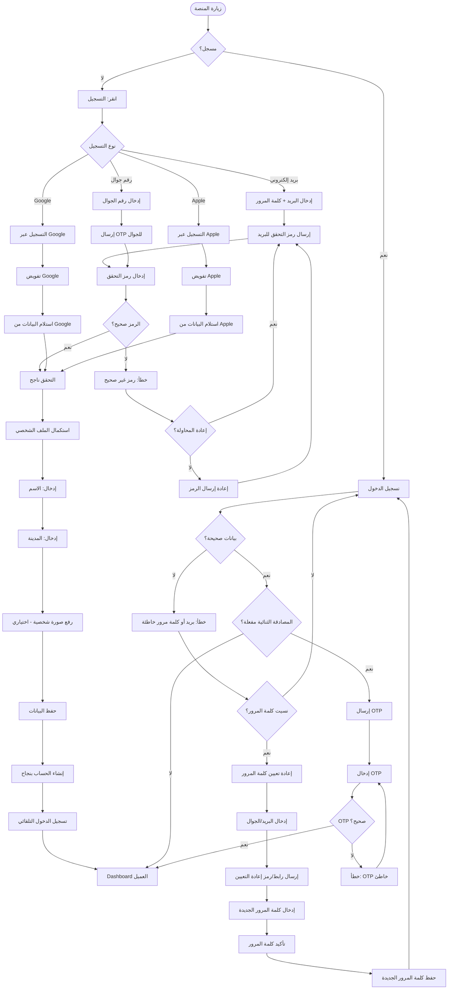

# رحلة التسجيل وإعداد الحساب - Client Registration Flow

## نظرة عامة
هذا التدفق يغطي جميع سيناريوهات تسجيل العميل الجديد وإعداد حسابه، بما في ذلك:
- التسجيل عبر البريد الإلكتروني
- التسجيل عبر رقم الجوال
- التسجيل عبر Google
- التسجيل عبر Apple
- التحقق من الحساب
- استكمال الملف الشخصي
- تسجيل الدخول
- استعادة كلمة المرور
- المصادقة الثنائية

---

## خريطة التدفق

---

## السيناريوهات المغطاة

### ✅ التسجيل الناجح
1. المستخدم يختار طريقة التسجيل
2. يتم التحقق من البيانات
3. يستكمل الملف الشخصي
4. يتم إنشاء الحساب بنجاح

### ⚠️ حالات الخطأ
- رمز التحقق غير صحيح
- بيانات تسجيل دخول خاطئة
- فشل المصادقة الثنائية
- مشاكل في التكامل مع Google/Apple

### 🔐 الأمان
- التحقق عبر OTP
- المصادقة الثنائية الاختيارية
- تشفير كلمات المرور
- حماية من محاولات التسجيل المتكررة

---

## ملاحظات تقنية

- **OTP Expiry**: رموز التحقق تنتهي بعد 10 دقائق
- **Rate Limiting**: حد أقصى 5 محاولات تسجيل دخول فاشلة
- **Session Duration**: الجلسة تستمر 30 يوم مع خيار "تذكرني"
- **Password Requirements**: 8 أحرف على الأقل، تحتوي على أرقام وحروف
