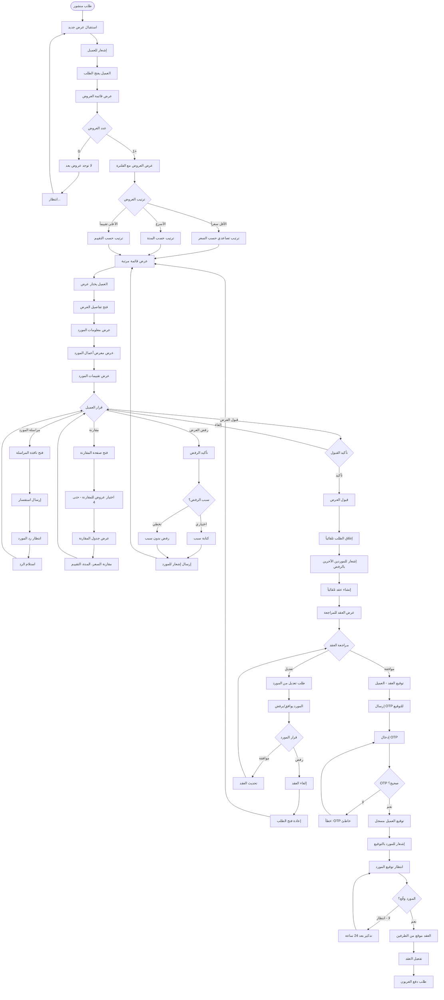

# مراجعة العروض واختيار المورد - Review Offers Flow

## نظرة عامة
تدفق مراجعة العروض المقدمة من الموردين واختيار العرض المناسب.

---

## خريطة التدفق

---

## المميزات الرئيسية

### 🔍 فلترة وترتيب العروض
- حسب السعر (الأقل/الأعلى)
- حسب المدة (الأسرع)
- حسب التقييم (الأعلى)

### 📊 مقارنة العروض
- مقارنة حتى 4 عروض
- جدول مقارنة شامل
- تسليط الضوء على الفروقات

### 💬 التواصل مع الموردين
- مراسلة مباشرة
- طرح الأسئلة
- طلب توضيحات

### ✅ قبول العرض
- مراجعة العقد
- طلب تعديلات
- توقيع إلكتروني آمن
