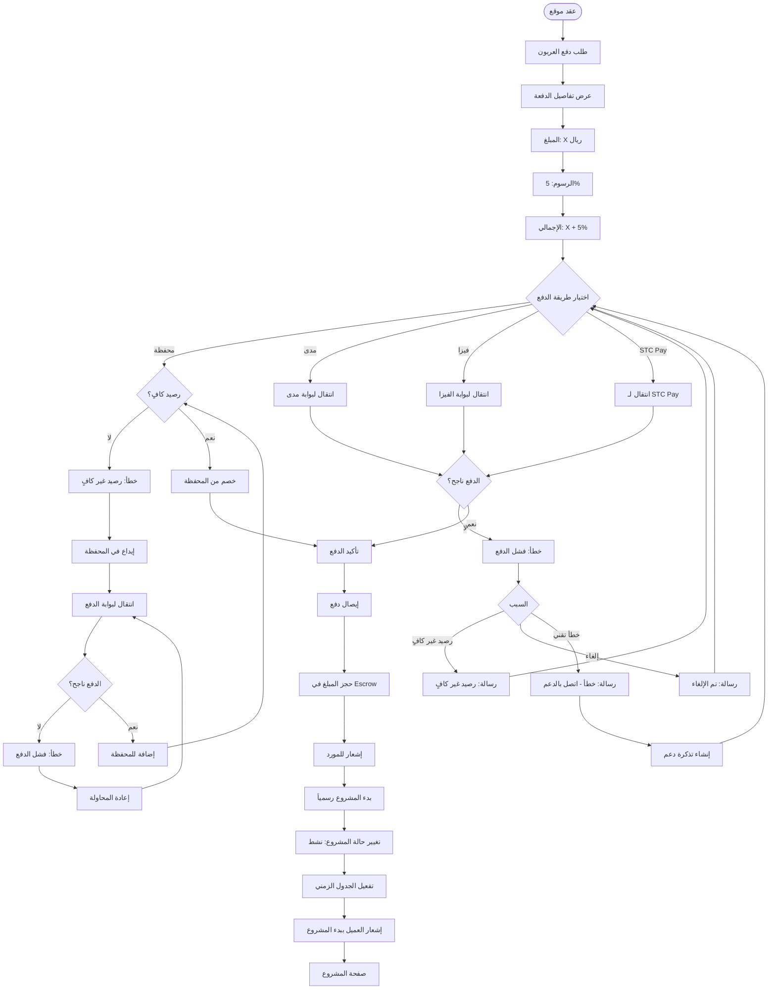

# دفع العربون وبدء المشروع - Payment & Project Start Flow

## نظرة عامة
تدفق دفع العربون وبدء المشروع بعد توقيع العقد.

---

## خريطة التدفق

---

## طرق الدفع المدعومة

### 💳 البطاقات
- مدى (Mada)
- فيزا (Visa)
- ماستركارد (Mastercard)

### 📱 المحافظ الإلكترونية
- STC Pay
- محفظة المنصة

### 🔒 الأمان
- جميع المدفوعات محمية بـ SSL
- المبالغ محجوزة في Escrow
- إيصالات فورية
