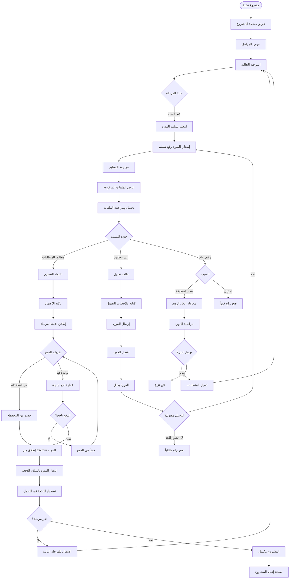

# متابعة المشروع والتسليمات - Project Tracking Flow

## نظرة عامة
تدفق متابعة المشروع ومراجعة التسليمات من المورد.

---

## خريطة التدفق

---

## المراحل الرئيسية

### 📋 مراجعة التسليمات
- تحميل الملفات
- مراجعة الجودة
- التحقق من المطابقة

### ✅ اعتماد التسليم
- تأكيد الاعتماد
- إطلاق الدفعة
- الانتقال للمرحلة التالية

### 🔄 طلب التعديلات
- كتابة ملاحظات واضحة
- تحديد نقاط التعديل
- متابعة التعديلات

### ⚠️ حالات الرفض
- محاولة الحل الودي
- فتح نزاع عند الضرورة
