# 🗺️ خرائط التدفق الشاملة - جميع الحالات والسيناريوهات

---

## 📋 فهرس خرائط التدفق

1. [تدفق العميل - جميع السيناريوهات](#client-flow)
2. [تدفق المورد - جميع السيناريوهات](#supplier-flow)
3. [تدفق الإدارة - جميع السيناريوهات](#admin-flow)
4. [تدفقات المعاملات المالية](#payment-flow)
5. [تدفقات النزاعات](#dispute-flow)
6. [تدفقات الإشعارات والرسائل](#notification-flow)
7. [حالات الطوارئ والأخطاء](#emergency-flow)

---

## 1️⃣ تدفق العميل - جميع السيناريوهات

### 1.1 رحلة التسجيل وإعداد الحساب

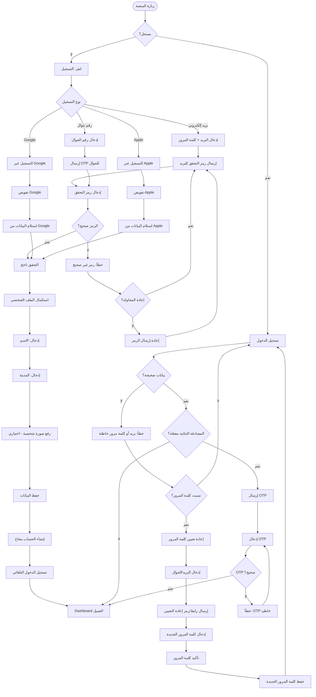

---

### 1.2 إنشاء طلب - جميع السيناريوهات

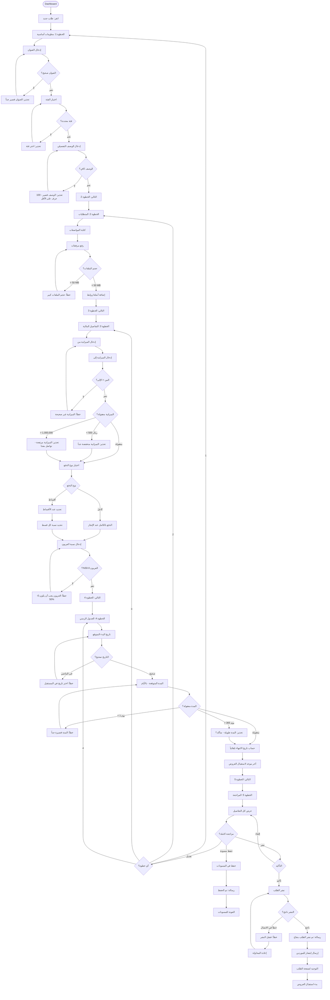

---

### 1.3 مراجعة العروض واختيار المورد

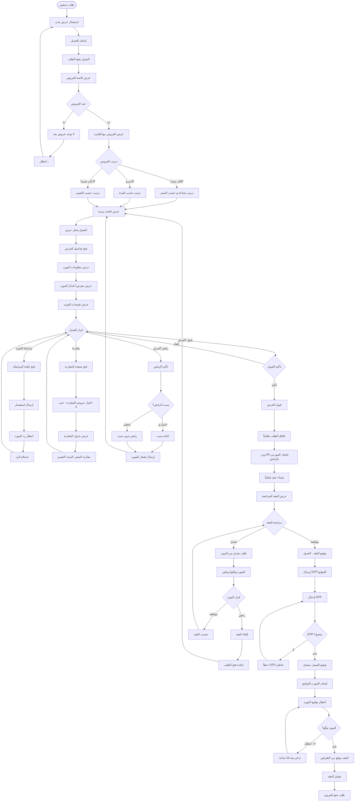

---

### 1.4 دفع العربون وبدء المشروع

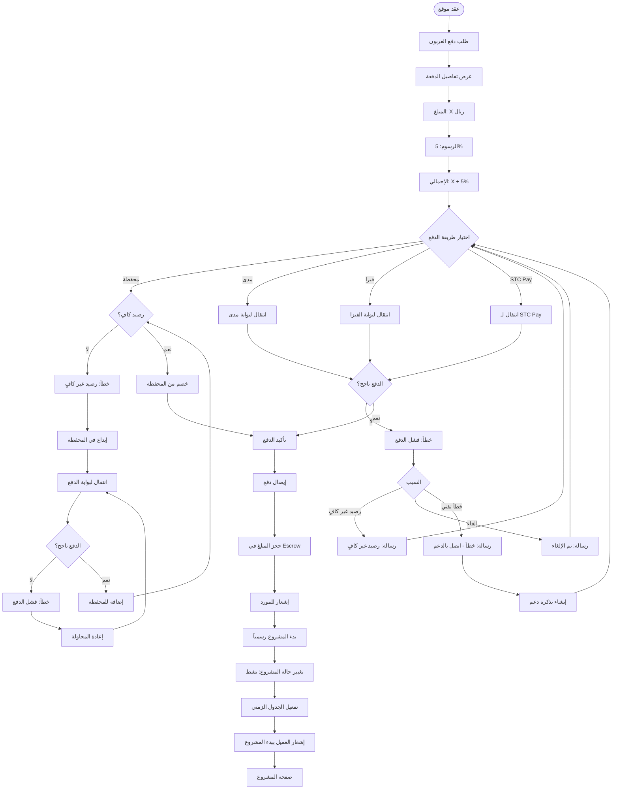

---

### 1.5 متابعة المشروع والتسليمات

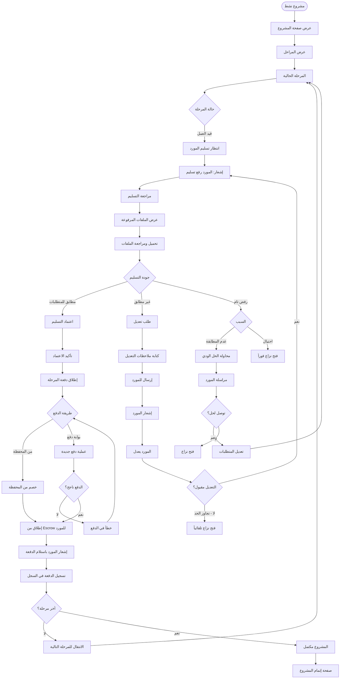

---

### 1.6 إتمام المشروع والتقييم

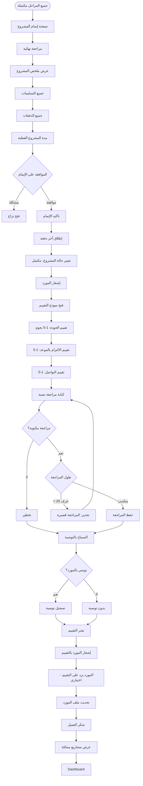

---

### 1.7 فتح نزاع - السيناريو الكامل

```mermaid
graph TD
    START([مشكلة في المشروع]) --> A{نوع المشكلة}

    A -->|تأخير| B[محاولة التواصل أولاً]
    A -->|جودة منخفضة| C[طلب تعديل]
    A -->|عدم استجابة| D[محاولة المراسلة]
    A -->|احتيال| E[فتح نزاع فوراً]

    B --> F{المورد استجاب؟}
    F -->|نعم| G[حل المشكلة]
    F -->|لا - 3 أيام| H[فتح نزاع]

    C --> I{عدد مرات التعديل}
    I --"< 3"--> J[محاولة جديدة]
    I --">= 3"--> H

    D --> K{رد المورد؟}
    K -->|نعم| L[متابعة المشروع]
    K -->|لا - 48 ساعة| H

    E --> H
    H --> M[صفحة فتح نزاع]

    M --> N[اختيار المشروع]
    N --> O[اختيار سبب النزاع]
    O --> P{السبب}
    P -->|تأخير| Q[إدخال الموعد الأصلي]
    P -->|جودة| R[تحديد المشكلة]
    P -->|احتيال| S[وصف الاحتيال]
    P -->|أخرى| T[وصف تفصيلي]

    Q --> U[كتابة الوصف]
    R --> U
    S --> U
    T --> U

    U --> V[تحديد المطالب]
    V --> W{نوع المطالب}
    W -->|استرجاع كامل| X[طلب استرجاع 100%]
    W -->|استرجاع جزئي| Y[تحديد النسبة]
    W -->|إعادة العمل| Z[طلب إعادة بدون تكلفة]
    W -->|تعويض| AA[تحديد التعويض]
    W -->|إلغاء| AB[طلب إلغاء العقد]

    X --> AC[رفع الأدلة]
    Y --> AC
    Z --> AC
    AA --> AC
    AB --> AC

    AC --> AD[إرفاق ملفات]
    AD --> AE{نوع الأدلة}
    AE -->|محادثات| AF[لقطات شاشة المحادثات]
    AE -->|عقد| AG[نسخة العقد]
    AE -->|تسليمات| AH[الملفات المسلمة]
    AE -->|أخرى| AI[مستندات أخرى]

    AF --> AJ[مراجعة قبل الإرسال]
    AG --> AJ
    AH --> AJ
    AI --> AJ

    AJ --> AK{التأكيد}
    AK -->|إلغاء| AL[العودة للمشروع]
    AK -->|تأكيد| AM[إرسال النزاع]

    AM --> AN[تسجيل النزاع]
    AN --> AO[إشعار الإدارة]
    AO --> AP[إشعار المورد]
    AP --> AQ[تجميد المشروع]
    AQ --> AR[حجز المدفوعات في Escrow]

    AR --> AS[انتظار رد المورد - 48 ساعة]
    AS --> AT{المورد رد؟}
    AT -->|لا| AU[اعتبار إقرار ضمني]
    AT -->|نعم| AV[استلام رد المورد]

    AU --> AW[مراجعة الإدارة]
    AV --> AX[استلام أدلة المورد]
    AX --> AW

    AW --> AY{مدة المراجعة}
    AY -->|بسيط| AZ[1-2 يوم]
    AY -->|معقد| BA[3-5 أيام]
    AY -->|شديد التعقيد| BB[7-10 أيام]

    AZ --> BC[إصدار القرار]
    BA --> BC
    BB --> BC

    BC --> BD{القرار}
    BD -->|لصالح العميل - كامل| BE[استرجاع كامل]
    BD -->|لصالح العميل - جزئي| BF[استرجاع جزئي]
    BD -->|لصالح المورد| BG[رفض المطالبة]
    BD -->|حل وسط| BH[تقسيم التعويض]

    BE --> BI[إطلاق المبلغ للعميل]
    BF --> BJ[إطلاق جزئي للعميل]
    BG --> BK[إطلاق للمورد]
    BH --> BL[تقسيم بين الطرفين]

    BI --> BM[تحديث السجل]
    BJ --> BM
    BK --> BM
    BL --> BM

    BM --> BN{رضا العميل}
    BN -->|غير راضٍ| BO[طلب استئناف]
    BN -->|راضٍ| BP[إغلاق النزاع]

    BO --> BQ[فترة استئناف: 7 أيام]
    BQ --> BR[مراجعة عليا]
    BR --> BS[قرار نهائي]
    BS --> BP

    BP --> BT[إشعار الطرفين]
    BT --> BU[تحديث التقييمات]
    BU --> BV[النهاية]
```

---

## 2️⃣ تدفق المورد - جميع السيناريوهات

### 2.1 التسجيل والتحقق

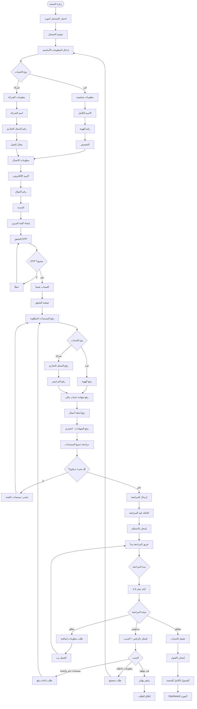

---

### 2.2 البحث عن طلبات وتقديم عروض

```mermaid
graph TD
    START([Dashboard المورد]) --> A[تصفح الطلبات الجديدة]

    A --> B{عرض الطلبات}
    B -->|جميع الطلبات| C[قائمة كاملة]
    B -->|طلبات مناسبة| D[طلبات موصى بها]
    B -->|محفوظة| E[الطلبات المحفوظة]

    C --> F[تطبيق فلاتر]
    D --> F
    E --> F

    F --> G{الفلاتر}
    G -->|الفئة| H[اختيار تخصص]
    G -->|الميزانية| I[نطاق سعري]
    G -->|المدة| J[نطاق زمني]
    G -->|الموقع| K[المدينة]

    H --> L[عرض نتائج مفلترة]
    I --> L
    J --> L
    K --> L

    L --> M[اختيار طلب]
    M --> N[فتح تفاصيل الطلب]
    N --> O[قراءة الوصف]
    O --> P[مراجعة المتطلبات]
    P --> Q[عرض المرفقات]
    Q --> R[معلومات العميل]
    R --> S[العروض الحالية]

    S --> T{قرار المورد}
    T -->|حفظ للمراجعة| U[إضافة للمحفوظات]
    U --> V[رسالة: تم الحفظ]
    V --> L

    T -->|مراسلة العميل| W[فتح نافذة الرسائل]
    W --> X[كتابة استفسار]
    X --> Y[إرسال]
    Y --> Z[انتظار رد العميل]
    Z --> AA{العميل رد؟}
    AA -->|نعم| AB[قراءة الرد]
    AB --> T
    AA -->|لا - 24 ساعة| AC[تذكير]
    AC --> T

    T -->|تقديم عرض| AD[فتح نموذج العرض]

    AD --> AE[تحديد السعر]
    AE --> AF{السعر معقول؟}
    AF -->|أقل من الحد الأدنى| AG[تحذير: السعر منخفض]
    AF -->|أعلى من السقف| AH[تحذير: السعر مرتفع]
    AF -->|معقول| AI[تحديد المدة]

    AG --> AJ{تأكيد المورد}
    AJ -->|تعديل| AE
    AJ -->|متأكد| AI

    AH --> AK{تأكيد المورد}
    AK -->|تعديل| AE
    AK -->|متأكد| AI

    AI --> AL[تحديد تاريخ البدء]
    AL --> AM[حساب تاريخ التسليم]
    AM --> AN[كتابة وصف العرض]

    AN --> AO{الوصف كافٍ؟}
    AO --"< 100 حرف"--> AP[تحذير: وصف قصير]
    AP --> AN
    AO -->|مناسب| AQ[تحديد المراحل]

    AQ --> AR[إضافة مرحلة]
    AR --> AS[عنوان المرحلة]
    AS --> AT[مدة المرحلة]
    AT --> AU[نسبة الدفع]
    AU --> AV[المخرجات المتوقعة]

    AV --> AW{إضافة مرحلة أخرى؟}
    AW -->|نعم| AR
    AW -->|لا| AX[مراجعة المراحل]

    AX --> AY{المجموع 100%؟}
    AY -->|لا| AZ[خطأ: النسب يجب = 100%]
    AZ --> AQ
    AY -->|نعم| BA[رفع مرفقات]

    BA --> BB{نوع المرفقات}
    BB -->|Portfolio| BC[رفع معرض الأعمال]
    BB -->|CV| BD[رفع السيرة الذاتية]
    BB -->|شهادات| BE[رفع الشهادات]
    BB -->|عينات| BF[رفع نماذج عمل]

    BC --> BG[مراجعة العرض النهائي]
    BD --> BG
    BE --> BG
    BF --> BG

    BG --> BH[عرض ملخص]
    BH --> BI{التأكيد}
    BI -->|حفظ مسودة| BJ[حفظ في المسودات]
    BJ --> BK[رسالة: تم الحفظ]
    BK --> L

    BI -->|تقديم| BL[إرسال العرض]

    BL --> BM{الإرسال ناجح؟}
    BM -->|خطأ| BN[خطأ في الاتصال]
    BN --> BO[إعادة المحاولة]
    BO --> BL

    BM -->|نعم| BP[تسجيل العرض]
    BP --> BQ[إشعار العميل]
    BQ --> BR[تحديث قائمة عروضي]
    BR --> BS[صفحة متابعة العرض]

    BS --> BT[عرض الإحصائيات]
    BT --> BU[عدد المشاهدات]
    BU --> BV[ترتيب العرض]
    BV --> BW[آخر مشاهدة من العميل]

    BW --> BX{حالة العرض}
    BX -->|معلق| BY[انتظار قرار العميل]
    BX -->|مشاهد| BZ[العميل شاهد العرض]
    BX -->|تم التواصل| CA[العميل راسل]

    BY --> CB[تحديث كل ساعة]
    BZ --> CB
    CA --> CC[الرد على العميل]
    CC --> CB

    CB --> CD{قرار العميل}
    CD -->|قبول| CE[إشعار بالقبول]
    CD -->|رفض| CF[إشعار بالرفض]
    CD -->|لا قرار - 7 أيام| CG[تذكير للعميل]

    CF --> CH[عرض السبب إن وجد]
    CH --> CI[تحديث حالة: مرفوض]
    CI --> L

    CG --> CJ{بعد التذكير}
    CJ -->|قرار| CD
    CJ -->|لا قرار - 14 يوم| CK[العرض منتهي تلقائياً]
    CK --> CI

    CE --> CL[إنشاء عقد]
```

---

### 2.3 التعامل مع العقد والمشروع

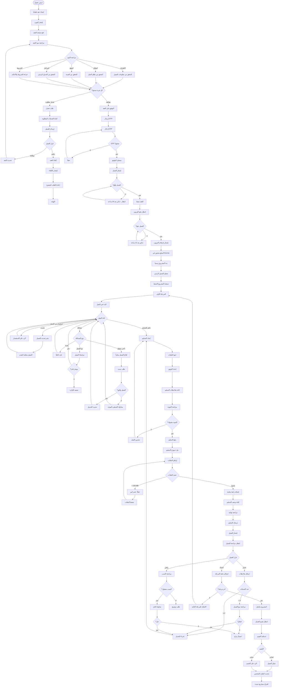

---

### 2.4 إدارة الأرباح والسحب

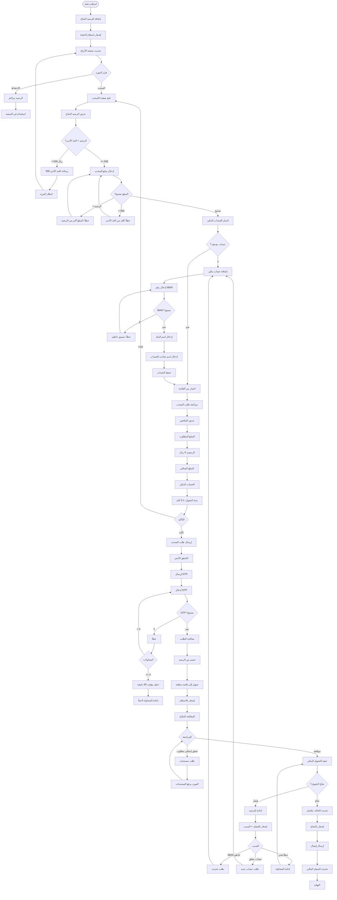

---

## 3️⃣ تدفق الإدارة - جميع السيناريوهات

### 3.1 مراجعة تسجيل الموردين

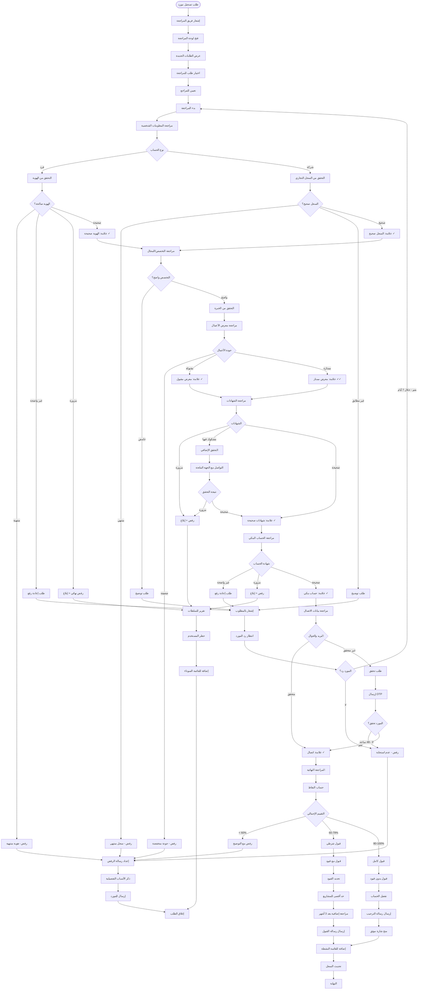

---

### 3.2 إدارة النزاعات

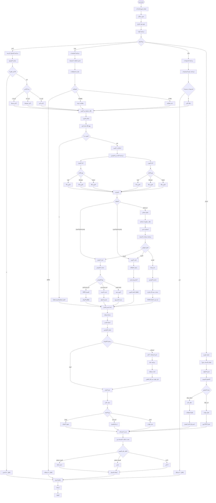

---

## 4️⃣ تدفقات المعاملات المالية

### 4.1 دورة الدفع الكاملة

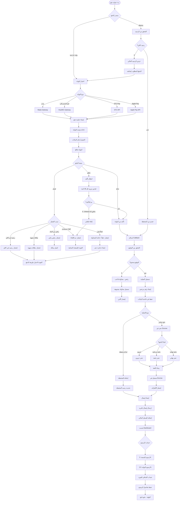

---

### 4.2 إطلاق الدفعات من Escrow

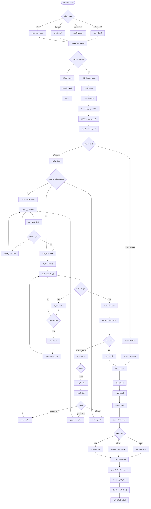

---

### 4.3 معالجة السحوبات

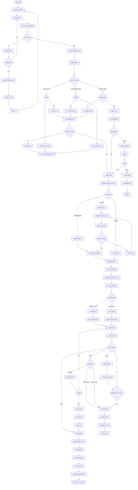

---

## 5️⃣ تدفقات الإشعارات والرسائل

### 5.1 نظام الإشعارات الشامل

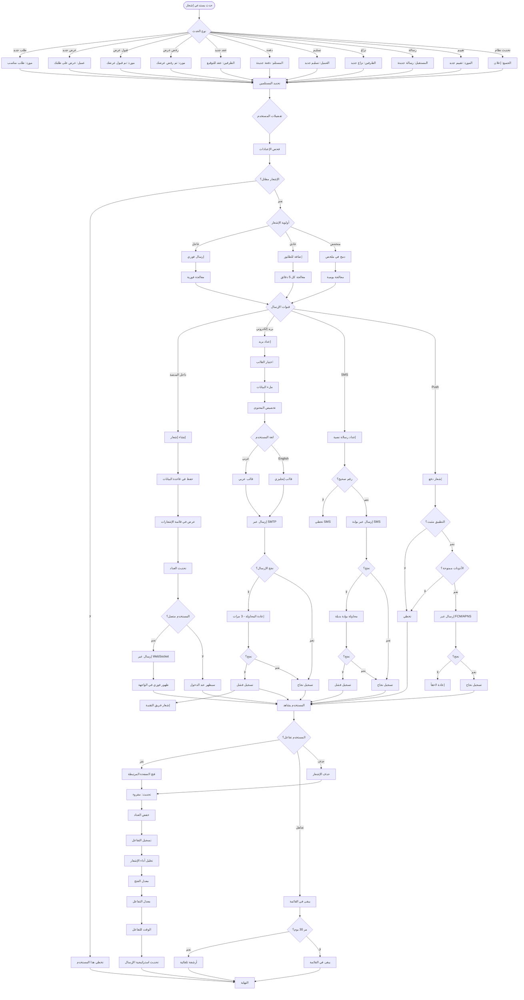

---

### 5.2 نظام المراسلة الكامل

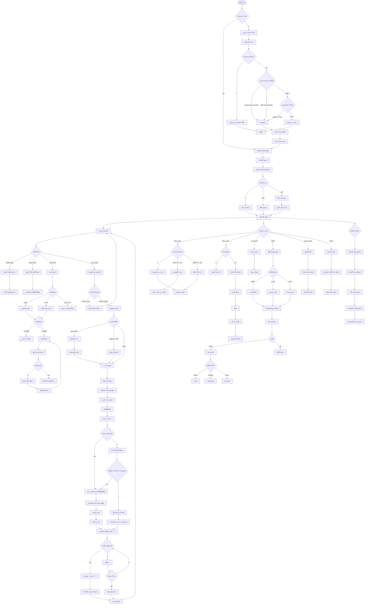

---

## 6️⃣ حالات الطوارئ والأخطاء

### 6.1 التعامل مع الأخطاء التقنية

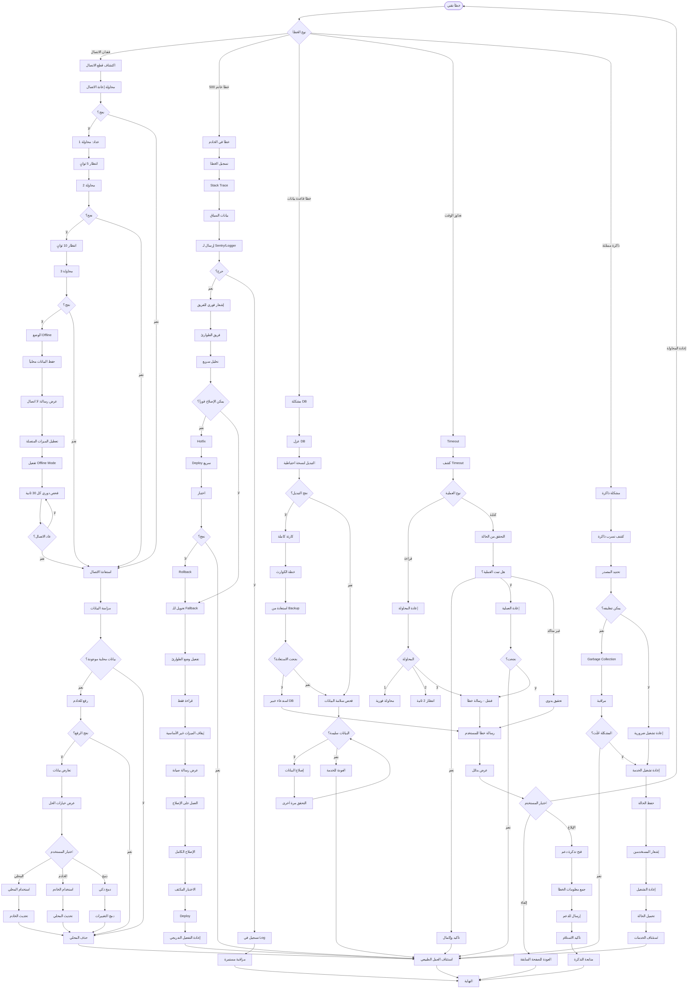

---

### 6.2 التعامل مع محاولات الاختراق والأمن

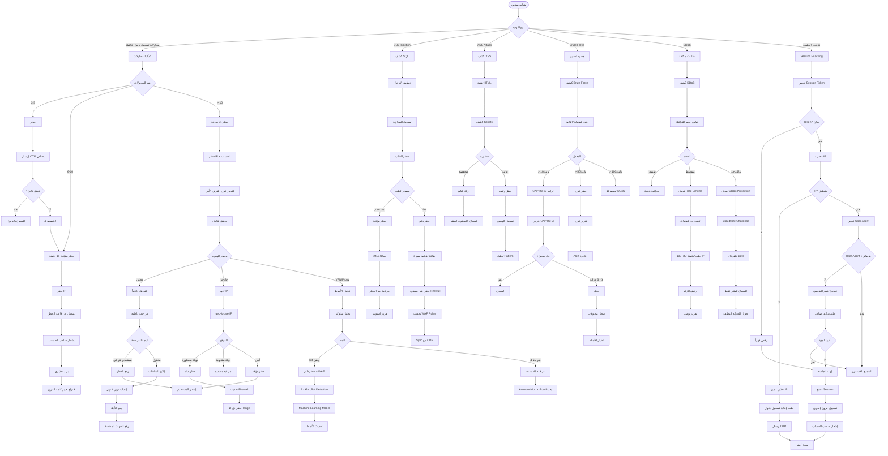
