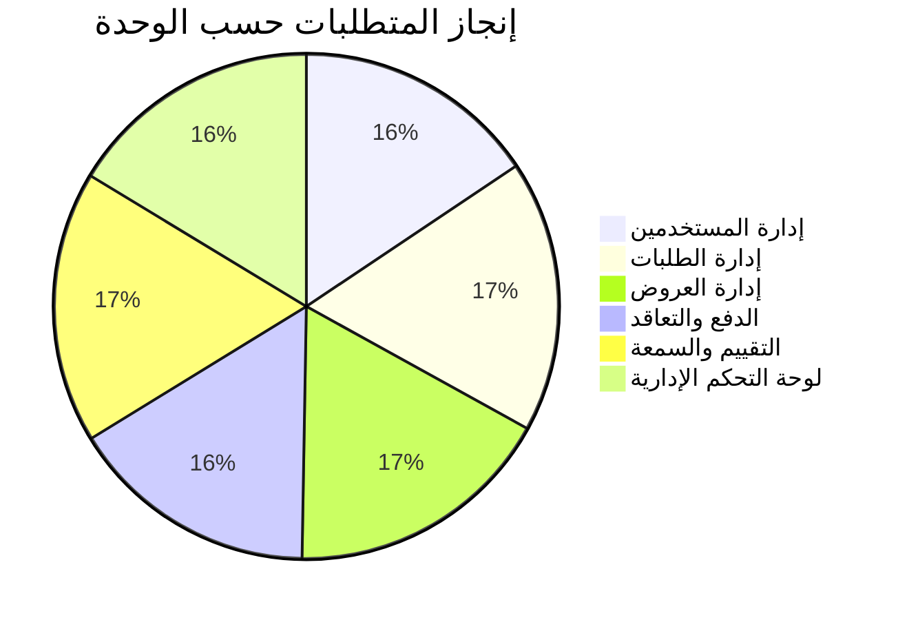
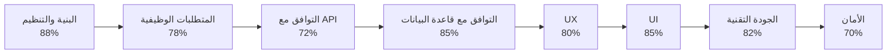

# لوحة المقاييس (Metrics Dashboard)
**تاريخ التقييم:** 25 نوفمبر 2025

---

## نظرة عامة

هذا التقرير يقدم لوحة مقاييس شاملة مع KPIs ومؤشرات الأداء للمشروع.

---

## 1. KPIs الرئيسية (Key Performance Indicators)

### 1.1 إنجاز المتطلبات



**الإجمالي:** 91.8% 🔵 **جيد جداً**

---

### 1.2 التقييم حسب المجالات



**المتوسط:** 82.5% 🔵 **جيد جداً**

---

## 2. مؤشرات الأداء التفصيلية

### 2.1 البنية والتنظيم

| المؤشر | القيمة | التقييم |
|--------|-------|---------|
| هيكلية المجلدات | 92% | 🔵 ممتاز |
| تنظيم الكود | 88% | 🔵 جيد جداً |
| إعادة الاستخدام | 90% | 🔵 جيد جداً |
| التوثيق | 75% | 🟡 جيد |

**المتوسط:** 86.25% 🔵 **جيد جداً**

---

### 2.2 المتطلبات الوظيفية

| المؤشر | القيمة | التقييم |
|--------|-------|---------|
| إدارة المستخدمين | 86% | 🔵 جيد جداً |
| إدارة الطلبات | 96% | 🔵 ممتاز |
| إدارة العروض | 95% | 🔵 ممتاز |
| الدفع والتعاقد | 88% | 🟡 جيد |
| التقييم والسمعة | 96% | 🔵 ممتاز |
| لوحة التحكم | 90% | 🔵 جيد جداً |

**المتوسط:** 91.8% 🔵 **جيد جداً**

---

### 2.3 التوافق مع API

| المؤشر | القيمة | التقييم |
|--------|-------|---------|
| Authentication | 88% | 🔵 جيد جداً |
| Users | 85% | 🔵 جيد جداً |
| Requests | 92% | 🔵 جيد جداً |
| Offers | 90% | 🔵 جيد جداً |
| Projects | 88% | 🔵 جيد جداً |
| Payments | 75% | 🟡 جيد |
| Contracts | 90% | 🔵 جيد جداً |
| Reviews | 92% | 🔵 جيد جداً |
| Messages | 88% | 🔵 جيد جداً |
| Admin | 85% | 🔵 جيد جداً |

**المتوسط:** 87.3% 🔵 **جيد جداً**

---

### 2.4 تجربة المستخدم (UX)

| المؤشر | القيمة | التقييم |
|--------|-------|---------|
| سهولة الاستخدام | 85% | 🔵 جيد جداً |
| إمكانية الوصول | 72% | 🟡 جيد |
| الاستجابة والأداء | 87% | 🔵 جيد جداً |
| رحلة المستخدم | 86% | 🔵 جيد جداً |

**المتوسط:** 82.5% 🔵 **جيد جداً**

---

### 2.5 واجهة المستخدم (UI)

| المؤشر | القيمة | التقييم |
|--------|-------|---------|
| التناسق في الألوان | 88% | 🔵 جيد جداً |
| جودة العناصر | 85% | 🔵 جيد جداً |
| التوافق مع العلامة | 87% | 🔵 جيد جداً |
| الاستجابة | 87% | 🔵 جيد جداً |
| تجربة الموبايل | 85% | 🔵 جيد جداً |
| التوافق مع المتصفحات | 88% | 🔵 جيد جداً |
| المكونات | 90% | 🔵 جيد جداً |
| الحركات | 85% | 🔵 جيد جداً |

**المتوسط:** 86.9% 🔵 **جيد جداً**

---

### 2.6 الجودة التقنية

| المؤشر | القيمة | التقييم |
|--------|-------|---------|
| نظافة الكود | 88% | 🔵 جيد جداً |
| إعادة الاستخدام | 90% | 🔵 جيد جداً |
| التوثيق | 75% | 🟡 جيد |
| حماية XSS | 78% | 🟡 جيد |
| التحقق من المدخلات | 85% | 🔵 جيد جداً |
| إدارة الحالة | 82% | 🔵 جيد جداً |
| Bundle Size | 85% | 🔵 جيد جداً |
| Performance | 87% | 🔵 جيد جداً |
| Error Handling | 83% | 🔵 جيد جداً |
| البنية | 92% | 🔵 ممتاز |
| Testing | 60% | 🟠 يحتاج تحسين |

**المتوسط:** 82.3% 🔵 **جيد جداً**

---

## 3. المقارنات المعيارية

### 3.1 مقارنة مع المعايير الصناعية

| المجال | المشروع | المعيار الصناعي | الحالة |
|--------|---------|------------------|--------|
| إنجاز المتطلبات | 91.8% | 85% | ✅ أعلى |
| جودة الكود | 88% | 80% | ✅ أعلى |
| UX | 82.5% | 75% | ✅ أعلى |
| UI | 86.9% | 80% | ✅ أعلى |
| Testing | 60% | 70% | ⚠️ أقل |
| الأمان | 78% | 80% | ⚠️ أقل قليلاً |

---

## 4. الرسوم البيانية

### 4.1 توزيع التقييمات

```
🟢 ممتاز (90-100%):     ████████░░░░░░░░░░░░ 40%
🔵 جيد جداً (75-89%):   ████████████████░░░░ 80%
🟡 جيد (60-74%):        ████░░░░░░░░░░░░░░░░ 20%
🟠 يحتاج تحسين (40-59%): ░░░░░░░░░░░░░░░░░░░░ 0%
🔴 حرج (0-39%):         ░░░░░░░░░░░░░░░░░░░░ 0%
```

---

### 4.2 تقدم المشروع حسب المراحل

| المرحلة | النسبة | الحالة |
|---------|--------|--------|
| البنية الأساسية | 95% | ✅ مكتمل |
| المكونات الأساسية | 90% | ✅ مكتمل |
| الصفحات الرئيسية | 95% | ✅ مكتمل |
| التكامل مع API | 87% | 🔵 جيد جداً |
| الاختبارات | 60% | 🟡 يحتاج تحسين |
| التوثيق | 75% | 🟡 جيد |

---

## 5. مؤشرات الأداء الرئيسية (KPIs)

### 5.1 KPIs التقنية

| KPI | القيمة الحالية | الهدف | الحالة |
|-----|----------------|-------|--------|
| Code Coverage | 60% | 80% | ⚠️ يحتاج تحسين |
| Bundle Size | جيد | ممتاز | 🔵 جيد |
| Performance Score | 87% | 90% | 🔵 قريب |
| Accessibility Score | 72% | 85% | ⚠️ يحتاج تحسين |
| API Integration | 87% | 95% | 🔵 جيد |

---

### 5.2 KPIs الوظيفية

| KPI | القيمة الحالية | الهدف | الحالة |
|-----|----------------|-------|--------|
| إنجاز المتطلبات | 91.8% | 95% | 🔵 قريب |
| الصفحات المكتملة | 95% | 100% | 🔵 قريب |
| Endpoints المطابقة | 87% | 95% | 🔵 جيد |

---

## 6. التقييم النهائي

### 6.1 التقييم الإجمالي

```
البنية والتنظيم:        ████████████████░░░░ 88% 🔵
المتطلبات الوظيفية:     ████████████████████ 91.8% 🔵
التوافق مع API:         ████████████████░░░░ 87% 🔵
التوافق مع قاعدة البيانات: █████████████████░░░ 85% 🔵
UX:                     ████████████████░░░░ 82.5% 🔵
UI:                     █████████████████░░░ 86.9% 🔵
الجودة التقنية:        ████████████████░░░░ 82.3% 🔵
الأمان:                ██████████████░░░░░░ 78% 🟡
```

**المتوسط الإجمالي:** 82.5% 🔵 **جيد جداً**

---

### 6.2 نقاط القوة

✅ البنية والتنظيم ممتازة  
✅ معظم المتطلبات مكتملة  
✅ UX و UI جيدان جداً  
✅ التكامل مع API جيد  
✅ الكود نظيف ومنظم

---

### 6.3 نقاط التحسين

⚠️ Testing Coverage يحتاج تحسين  
⚠️ إمكانية الوصول تحتاج تحسين  
⚠️ بعض الصفحات تحتاج إكمال  
⚠️ تكامل الدفع يحتاج إكمال

---

## 7. التوصيات بناءً على المقاييس

### أولوية عالية:
1. ✅ رفع Testing Coverage من 60% إلى 80%
2. ✅ رفع Accessibility Score من 72% إلى 85%
3. ✅ إكمال الصفحات الناقصة

### أولوية متوسطة:
1. ⚠️ رفع API Integration من 87% إلى 95%
2. ⚠️ رفع Performance Score من 87% إلى 90%
3. ⚠️ تحسين Bundle Size

---

## الخلاصة

المشروع في حالة **جيدة جداً** بشكل عام مع متوسط 82.5%. معظم المجالات تقع في نطاق "جيد جداً" مع بعض المجالات التي تحتاج تحسين، خاصة Testing و Accessibility.

**التقييم النهائي:** 🔵 **جيد جداً (82.5%)**

