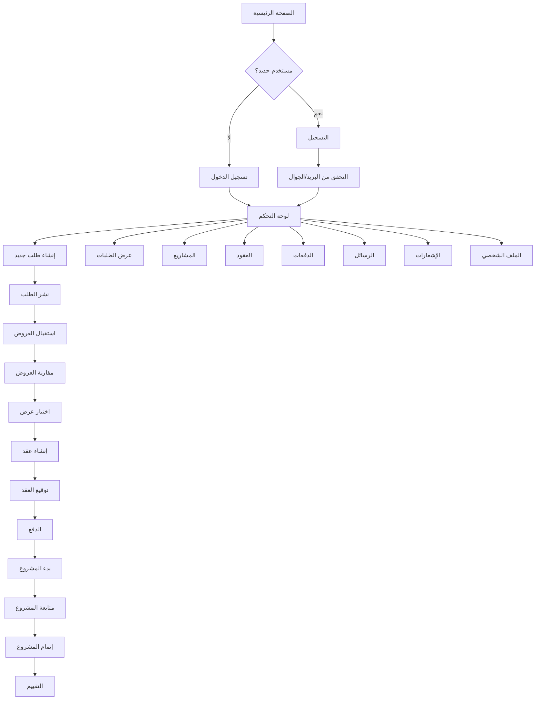
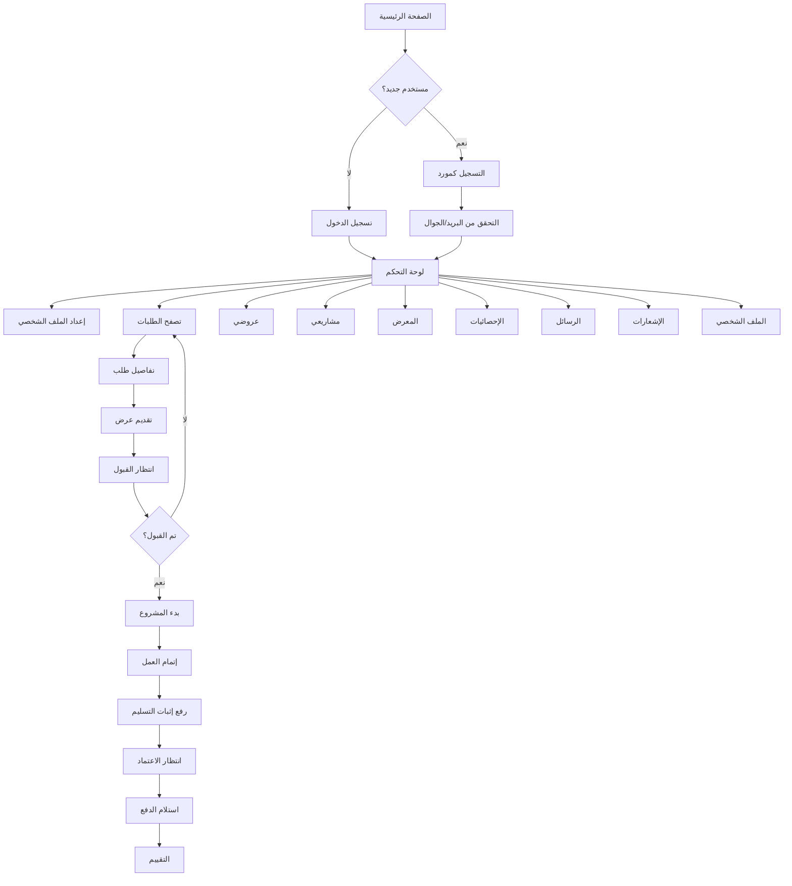
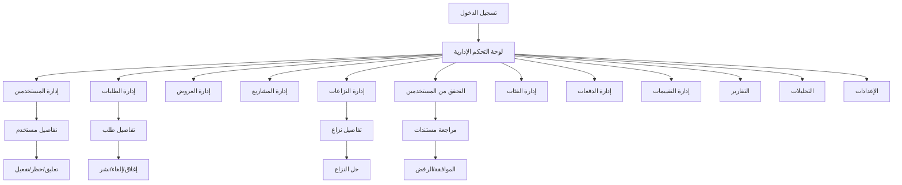

# User Navigation Flows - تصميم التنقل الشامل للمشروع

**تاريخ التصميم:** 25 نوفمبر 2025  
**المصمم:** مصمم تجربة مستخدم متخصص  
**التركيز:** رحلة كل مستخدم مع تنقل بديهي وواضح

---

## نظرة عامة

هذا التقرير يقدم تصميم شامل للتنقل بين الصفحات للمشروع بالكامل، مع التركيز على رحلة كل نوع مستخدم (Admin, Client, Supplier) بناءً على project-scope.

---

## 1. المبادئ الأساسية للتنقل

### 1.1 مبادئ التصميم

#### الوضوح أولاً:

-   كل صفحة يجب أن يكون واضحاً كيف وصل المستخدم إليها
-   كل صفحة يجب أن يكون واضحاً أين يمكنه الذهاب بعدها

#### البديهية:

-   التنقل يجب أن يكون منطقياً وطبيعياً
-   المستخدم يجب أن يفهم التدفق دون تعليمات

#### الاتساق:

-   نفس النمط للتنقل في جميع أنحاء التطبيق
-   نفس الموقع للأزرار والروابط

#### الكفاءة:

-   الوصول السريع للصفحات المهمة
-   أقل عدد من النقرات للوصول للهدف

---

## 2. رحلة العميل (Client Journey)

### 2.1 User Flow للعميل



---

### 2.2 Navigation Structure للعميل

#### Dashboard (لوحة التحكم):

```
┌─────────────────────────────────────────┐
│ Header: Logo | Notifications | Profile │
├──────────┬──────────────────────────────┤
│          │ Dashboard Content            │
│ Sidebar  │ ┌─────────────────────────┐ │
│          │ │ Quick Actions           │ │
│ • Dashboard│ │ [إنشاء طلب] [المشاريع]│ │
│          │ └─────────────────────────┘ │
│ • الطلبات│ ┌─────────────────────────┐ │
│   - جميع │ │ Statistics              │ │
│   - جديد │ └─────────────────────────┘ │
│   - طلباتي│ ┌─────────────────────────┐ │
│          │ │ Recent Activity         │ │
│ • المشاريع│ └─────────────────────────┘ │
│   - جميع │                              │
│   - نشطة │                              │
│   - مكتملة│                              │
│          │                              │
│ • العقود │                              │
│ • الدفعات│                              │
│ • الرسائل│                              │
│ • الإشعارات                              │
│ • الملف الشخصي                           │
└──────────┴──────────────────────────────┘
```

---

### 2.3 الصفحات الرئيسية للعميل

#### 1. Dashboard (لوحة التحكم)

**الوصول:** بعد تسجيل الدخول  
**الروابط السريعة:**

-   إنشاء طلب جديد
-   عرض المشاريع
-   الرسائل (مع badge)
-   الإشعارات (مع badge)

**التنقل من Dashboard:**

-   Sidebar Navigation
-   Quick Action Cards
-   Recent Activity Links

---

#### 2. الطلبات (Requests)

**الصفحات:**

-   `/requests` - جميع الطلبات
-   `/requests/new` - إنشاء طلب جديد
-   `/requests/my-requests` - طلباتي
-   `/requests/[id]` - تفاصيل طلب
-   `/requests/[id]/edit` - تعديل طلب
-   `/requests/[id]/offers` - عروض الطلب

**التنقل:**

-   من Dashboard → Sidebar → "الطلبات"
-   من Dashboard → Quick Action → "إنشاء طلب جديد"
-   من تفاصيل الطلب → "عودة إلى الطلبات"
-   من تفاصيل الطلب → "عرض العروض"

---

#### 3. المشاريع (Projects)

**الصفحات:**

-   `/projects` - جميع المشاريع
-   `/projects/[id]` - تفاصيل مشروع
-   `/projects/[id]/milestones` - مراحل المشروع
-   `/projects/[id]/delivery` - التسليم
-   `/projects/[id]/complete` - إتمام المشروع

**التنقل:**

-   من Dashboard → Sidebar → "المشاريع"
-   من Dashboard → Quick Action → "المشاريع"
-   من تفاصيل المشروع → "عودة إلى المشاريع"
-   من تفاصيل المشروع → "المراحل" / "التسليم"

---

#### 4. العقود (Contracts)

**الصفحات:**

-   `/contracts` - جميع العقود
-   `/contracts/new` - إنشاء عقد جديد
-   `/contracts/[id]` - تفاصيل عقد
-   `/contracts/[id]/sign` - توقيع العقد
-   `/contracts/[id]/versions` - نسخ العقد

**التنقل:**

-   من Dashboard → Sidebar → "العقود"
-   من تفاصيل المشروع → "عرض العقد"
-   من تفاصيل العقد → "توقيع العقد"

---

#### 5. الدفعات (Payments)

**الصفحات:**

-   `/payments` - جميع الدفعات
-   `/payments/wallet` - المحفظة
-   `/payments/history` - سجل الدفعات
-   `/payments/[id]` - تفاصيل دفعة
-   `/payments/initiate` - بدء عملية دفع

**التنقل:**

-   من Dashboard → Sidebar → "الدفعات"
-   من تفاصيل المشروع → "الدفعات"
-   من تفاصيل العقد → "الدفع"

---

#### 6. الرسائل (Messages)

**الصفحات:**

-   `/messages` - جميع المحادثات
-   `/messages/[id]` - محادثة
-   `/messages/new` - رسالة جديدة
-   `/messages/settings` - إعدادات الرسائل

**التنقل:**

-   من Dashboard → Sidebar → "الرسائل" (مع badge)
-   من Dashboard → Quick Action → "الرسائل"
-   من تفاصيل الطلب → "مراسلة المورد"
-   من تفاصيل المشروع → "الرسائل"

---

#### 7. الإشعارات (Notifications)

**الصفحات:**

-   `/notifications` - جميع الإشعارات
-   `/notifications/[id]` - تفاصيل إشعار
-   `/notifications/settings` - إعدادات الإشعارات

**التنقل:**

-   من Dashboard → Sidebar → "الإشعارات" (مع badge)
-   من Dashboard → Header → Bell Icon
-   من الإشعار → الصفحة ذات الصلة

---

#### 8. الملف الشخصي (Profile)

**الصفحات:**

-   `/profile` - الملف الشخصي
-   `/profile/edit` - تعديل الملف
-   `/profile/settings` - الإعدادات

**التنقل:**

-   من Dashboard → Sidebar → "الملف الشخصي"
-   من Dashboard → Header → Profile Icon

---

### 2.4 التدفقات الرئيسية للعميل

#### Flow 1: إنشاء طلب جديد

```
Dashboard → [إنشاء طلب جديد] →
نموذج إنشاء الطلب →
[حفظ كمسودة] / [نشر الطلب] →
تفاصيل الطلب →
[عودة إلى Dashboard]
```

#### Flow 2: اختيار عرض

```
Dashboard → [طلباتي] →
تفاصيل الطلب →
[عرض العروض] →
مقارنة العروض →
[اختيار عرض] →
إنشاء عقد →
توقيع العقد →
الدفع →
بدء المشروع
```

#### Flow 3: متابعة مشروع

```
Dashboard → [المشاريع] →
تفاصيل المشروع →
[المراحل] →
[التسليم] →
[اعتماد التسليم] →
[إتمام المشروع] →
[التقييم]
```

---

## 3. رحلة المورد (Supplier Journey)

### 3.1 User Flow للمورد



---

### 3.2 Navigation Structure للمورد

#### Dashboard (لوحة التحكم):

```
┌─────────────────────────────────────────┐
│ Header: Logo | Notifications | Profile │
├──────────┬──────────────────────────────┤
│          │ Dashboard Content            │
│ Sidebar  │ ┌─────────────────────────┐ │
│          │ │ Quick Actions           │ │
│ • Dashboard│ │ [تقديم عرض] [مشاريعي]│ │
│          │ └─────────────────────────┘ │
│ • العروض│ ┌─────────────────────────┐ │
│   - جميع │ │ Statistics              │ │
│   - جديد │ └─────────────────────────┘ │
│          │ ┌─────────────────────────┐ │
│ • المشاريع│ │ Recent Activity         │ │
│ • المعرض │ └─────────────────────────┘ │
│ • الإحصائيات│                              │
│ • الرسائل│                              │
│ • الإشعارات                              │
│ • الملف الشخصي                           │
└──────────┴──────────────────────────────┘
```

---

### 3.3 الصفحات الرئيسية للمورد

#### 1. Dashboard (لوحة التحكم)

**الوصول:** بعد تسجيل الدخول  
**الروابط السريعة:**

-   تقديم عرض جديد
-   مشاريعي
-   الرسائل (مع badge)
-   الإشعارات (مع badge)

---

#### 2. العروض (Offers)

**الصفحات:**

-   `/offers` - جميع عروضي
-   `/offers/new` - تقديم عرض جديد
-   `/offers/[id]` - تفاصيل عرض
-   `/offers/[id]/edit` - تعديل عرض

**التنقل:**

-   من Dashboard → Sidebar → "العروض"
-   من Dashboard → Quick Action → "تقديم عرض جديد"
-   من تفاصيل الطلب → "تقديم عرض"
-   من تفاصيل العرض → "عودة إلى العروض"

---

#### 3. المشاريع (Projects)

**الصفحات:**

-   `/supplier-projects` - جميع مشاريعي
-   `/supplier-projects/[id]` - تفاصيل مشروع
-   `/supplier-projects/[id]/delivery` - رفع التسليم

**التنقل:**

-   من Dashboard → Sidebar → "المشاريع"
-   من Dashboard → Quick Action → "مشاريعي"
-   من تفاصيل المشروع → "عودة إلى المشاريع"

---

#### 4. المعرض (Portfolio)

**الصفحات:**

-   `/portfolio` - المعرض
-   `/portfolio/new` - إضافة عمل

**التنقل:**

-   من Dashboard → Sidebar → "المعرض"
-   من الملف الشخصي → "المعرض"

---

#### 5. الإحصائيات (Statistics)

**الصفحات:**

-   `/stats` - الإحصائيات
-   `/stats/earnings` - الأرباح
-   `/stats/performance` - الأداء

**التنقل:**

-   من Dashboard → Sidebar → "الإحصائيات"

---

### 3.4 التدفقات الرئيسية للمورد

#### Flow 1: تقديم عرض

```
Dashboard → [تصفح الطلبات] →
تفاصيل الطلب →
[تقديم عرض] →
نموذج العرض →
[إرسال العرض] →
[عودة إلى الطلبات]
```

#### Flow 2: إتمام مشروع

```
Dashboard → [مشاريعي] →
تفاصيل المشروع →
[رفع التسليم] →
[إثبات التسليم] →
[انتظار الاعتماد] →
[استلام الدفع]
```

---

## 4. رحلة الإدارة (Admin Journey)

### 4.1 User Flow للإدارة



---

### 4.2 Navigation Structure للإدارة

#### Admin Dashboard:

```
┌─────────────────────────────────────────┐
│ Header: Logo | Notifications | Profile │
├──────────┬──────────────────────────────┤
│          │ Dashboard Content            │
│ Sidebar  │ ┌─────────────────────────┐ │
│          │ │ Overview Stats           │ │
│ • Dashboard│ └─────────────────────────┘ │
│          │ ┌─────────────────────────┐ │
│ • المستخدمين│ │ Recent Activity         │ │
│ • الموردين│ └─────────────────────────┘ │
│ • الطلبات│                              │
│ • العروض│                              │
│ • المشاريع│                              │
│ • النزاعات│                              │
│ • التحقق│                              │
│ • الفئات│                              │
│ • الدفعات│                              │
│ • التقييمات│                              │
│ • التقارير│                              │
│ • التحليلات│                              │
│ • الإعدادات│                              │
└──────────┴──────────────────────────────┘
```

---

### 4.3 الصفحات الرئيسية للإدارة

#### 1. Dashboard (لوحة التحكم)

**الوصول:** بعد تسجيل الدخول  
**المحتوى:**

-   إحصائيات شاملة
-   نشاط حديث
-   تنبيهات مهمة

---

#### 2. إدارة المستخدمين

**الصفحات:**

-   `/admin/users` - جميع المستخدمين
-   `/admin/users/[id]` - تفاصيل مستخدم
-   `/admin/users/new` - إضافة مستخدم

**التنقل:**

-   من Dashboard → Sidebar → "المستخدمين"
-   من تفاصيل المستخدم → "عودة إلى المستخدمين"

---

#### 3. إدارة الطلبات

**الصفحات:**

-   `/admin/requests` - جميع الطلبات
-   `/admin/requests/[id]` - تفاصيل طلب

**التنقل:**

-   من Dashboard → Sidebar → "الطلبات"
-   من تفاصيل الطلب → "عودة إلى الطلبات"

---

#### 4. إدارة النزاعات

**الصفحات:**

-   `/admin/disputes` - جميع النزاعات
-   `/admin/disputes/[id]` - تفاصيل نزاع

**التنقل:**

-   من Dashboard → Sidebar → "النزاعات" (مع badge)
-   من تفاصيل النزاع → "حل النزاع"

---

#### 5. التحقق من المستخدمين

**الصفحات:**

-   `/admin/verification` - طلبات التحقق
-   `/admin/verification/[id]` - مراجعة مستندات

**التنقل:**

-   من Dashboard → Sidebar → "التحقق" (مع badge)
-   من قائمة التحقق → "مراجعة المستندات"

---

## 5. التوصيات الشاملة للتنقل

### 5.1 Sidebar Navigation (لجميع المستخدمين)

#### الميزات المطلوبة:

1. ✅ Collapsible sidebar
2. ✅ Navigation items مع icons
3. ✅ Badges للإشعارات
4. ✅ Active state
5. ✅ Nested items (submenu)
6. ✅ Quick actions section
7. ✅ Responsive design

---

### 5.2 Header Navigation

#### الميزات المطلوبة:

1. ✅ Logo (رابط للصفحة الرئيسية)
2. ✅ Notifications icon (مع badge)
3. ✅ Profile dropdown
4. ✅ Language switcher
5. ✅ Theme toggle
6. ✅ Quick action buttons (في Dashboard)

---

### 5.3 Breadcrumbs

#### الميزات المطلوبة:

1. ✅ في جميع صفحات التفاصيل
2. ✅ روابط قابلة للنقر
3. ✅ Home icon
4. ✅ Current page (غير قابل للنقر)

---

### 5.4 Back Buttons

#### الميزات المطلوبة:

1. ✅ في صفحات التفاصيل
2. ✅ في صفحات التعديل
3. ✅ في صفحات الإجراءات
4. ✅ مع icon (ArrowLeft)
5. ✅ مع label واضح

---

### 5.5 Quick Action Cards

#### الميزات المطلوبة:

1. ✅ في Dashboard فقط
2. ✅ 4-6 cards
3. ✅ Icons واضحة
4. ✅ Titles واضحة
5. ✅ Descriptions
6. ✅ Badges عند الحاجة
7. ✅ Links للصفحات المهمة

---

## 6. Navigation Patterns

### 6.1 Pattern 1: Dashboard Navigation

```
Dashboard → Sidebar → [Section] → [Page]
Dashboard → Quick Action → [Page]
Dashboard → Recent Activity → [Related Page]
```

---

### 6.2 Pattern 2: Detail Page Navigation

```
List Page → [Item] → Detail Page
Detail Page → Back Button → List Page
Detail Page → Breadcrumbs → Previous Pages
Detail Page → Related Links → Related Pages
```

---

### 6.3 Pattern 3: Form Navigation

```
List Page → [Create Button] → Form Page
Form Page → [Cancel] → List Page
Form Page → [Save] → Detail Page
Form Page → [Save as Draft] → List Page
```

---

### 6.4 Pattern 4: Action Flow Navigation

```
Start → Step 1 → Step 2 → Step 3 → Complete
[Back] button in each step
Progress indicator
```

---

## 7. التوصيات النهائية

### 7.1 للعميل (Client)

#### Navigation Structure:

1. ✅ Sidebar مع sections:

    - الرئيسية (Dashboard)
    - الطلبات (مع submenu)
    - المشاريع (مع submenu)
    - العقود (مع submenu)
    - الدفعات (مع submenu)
    - التواصل (الرسائل، الإشعارات)
    - الحساب (الملف الشخصي، الإعدادات)

2. ✅ Quick Actions في Dashboard:

    - إنشاء طلب جديد
    - عرض المشاريع
    - الرسائل
    - الإشعارات

3. ✅ Back Buttons في:
    - صفحات التفاصيل
    - صفحات التعديل
    - صفحات الإجراءات

---

### 7.2 للمورد (Supplier)

#### Navigation Structure:

1. ✅ Sidebar مع sections:

    - الرئيسية (Dashboard)
    - العروض (مع submenu)
    - المشاريع
    - المعرض
    - الإحصائيات
    - التواصل (الرسائل، الإشعارات)
    - الحساب (الملف الشخصي)

2. ✅ Quick Actions في Dashboard:
    - تقديم عرض جديد
    - مشاريعي
    - الرسائل
    - الإشعارات

---

### 7.3 للإدارة (Admin)

#### Navigation Structure:

1. ✅ Sidebar مع sections:

    - الرئيسية (Dashboard)
    - المستخدمون (المستخدمين، الموردين)
    - المحتوى (الطلبات، العروض، المشاريع)
    - الإدارة (النزاعات، التحقق)
    - النظام (الفئات، الدفعات، التقييمات)
    - التقارير (التقارير، التحليلات)
    - الإعدادات

2. ✅ Badges للإشعارات:
    - النزاعات المعلقة
    - طلبات التحقق
    - التقارير

---

## 8. Implementation Priority

### أولوية عالية جداً:

1. ✅ **Sidebar Navigation للعميل**

    - الوقت: 3-5 أيام
    - التأثير: عالي جداً

2. ✅ **Sidebar Navigation للمورد**

    - الوقت: 2-3 أيام
    - التأثير: عالي

3. ✅ **Quick Action Cards في Dashboard**
    - الوقت: 2-3 أيام
    - التأثير: عالي

### أولوية عالية:

4. ✅ **Back Buttons في صفحات التفاصيل**

    - الوقت: 1-2 أيام
    - التأثير: متوسط

5. ✅ **تحسين Breadcrumbs**
    - الوقت: 1-2 أيام
    - التأثير: متوسط

---

## الخلاصة

التصميم المقترح يوفر:

-   ✅ تنقل بديهي وواضح لكل نوع مستخدم
-   ✅ رحلة مستخدم منطقية ومنظمة
-   ✅ وصول سريع للصفحات المهمة
-   ✅ تنقل متسق في جميع أنحاء التطبيق

**الوقت الإجمالي المتوقع:** 9-15 يوم عمل

**التأثير المتوقع:** تحسين كبير في تجربة المستخدم وسهولة التنقل
