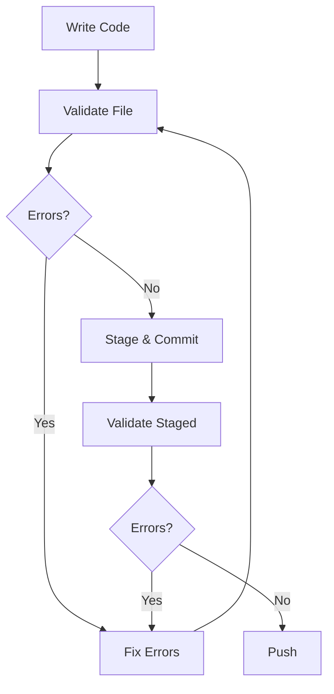

# ✅ Validation Scripts - Complete Guide

**All validation tools in one place**

---

## 📋 Available Validation Scripts

### 1. Design Rules Validation ⭐

**What it does:** Checks if your code follows the design rules from `component-building-guidelines.md`

**Command:**
```bash
npm run validate:design [path]
```

**Checks for:**
- ✅ Theme system usage (cssVars instead of hardcoded colors)
- ✅ Internationalization (useTranslations instead of hardcoded text)
- ✅ Component structure (proper naming, 'use client', props interface)
- ✅ Styling best practices
- ✅ Animation usage (framer-motion)
- ✅ RTL support (ms-/me- instead of ml-/mr-)

**Documentation:**
- [Full Design Rules Guide](./design-rules.md)
- [Quick Reference](../../quick-reference/design-rules.md)
- [Common Fixes](../../quick-reference/common-fixes.md)

---

### 2. Type Validation

**What it does:** Checks TypeScript types for correctness and completeness

**Command:**
```bash
npm run validate-types
```

**Checks for:**
- Props interfaces
- Correct type usage
- No `any` types
- Complete type definitions

**Documentation:**
- [Type Validation Guide](./types.md)

---

### 3. Naming Convention Validation

**What it does:** Ensures consistent naming across the codebase

**Command:**
```bash
npm run validate-naming
```

**Checks for:**
- PascalCase for components
- camelCase for functions/variables
- kebab-case for CSS files
- File names matching component names

---

### 4. Structure Validation

**What it does:** Verifies project structure follows the defined architecture

**Command:**
```bash
node scripts/validate-structure.js
```

**Checks for:**
- Correct folder structure
- Files in right locations
- Required files present

---

### 5. Import Validation

**What it does:** Checks for correct import statements

**Command:**
```bash
./scripts/check-imports.sh
```

**Checks for:**
- Valid import paths
- No circular dependencies
- Correct module usage

---

## 🚀 Quick Usage

### Check Single File

```bash
npm run validate:design src/components/MyComponent.tsx
```

### Check Directory

```bash
npm run validate:design src/components/features/home/
```

### Check Git Changes

```bash
# Unstaged changes
npm run validate:design $(git diff --name-only | grep -E '\.(tsx|ts)$')

# Staged changes
npm run validate:design $(git diff --name-only --cached | grep -E '\.(tsx|ts)$')
```

### Run All Validations

```bash
npm run validate:all  # or npm run check:health
```

### Generate Report

```bash
npm run validate:design src/ --json report.json
```

---

## 📊 Understanding Results

### Success Output

```
✨ رائع! جميع الملفات تتبع قواعد البناء بشكل صحيح
```

### Error Output

```
❌ src/components/MyComponent.tsx

Line 15: [ERROR] Hardcoded hex color found: #FAF8F1
  ❌ WRONG: style={{ backgroundColor: '#FAF8F1' }}
  ✅ CORRECT: import { cssVars } from '@/styles/theme'
            style={{ backgroundColor: cssVars.neutral.bg }}

═══════════════════════════════════════════════════════════════════
📊 Summary
═══════════════════════════════════════════════════════════════════
📁 Total Files: 1
❌ Total Errors: 1
⚠️  Total Warnings: 0
═══════════════════════════════════════════════════════════════════
```

---

## 🔧 Integration with Your Workflow

### Pre-commit Hook

```bash
# .husky/pre-commit
#!/bin/sh
STAGED_FILES=$(git diff --cached --name-only --diff-filter=ACM | grep -E '\.(tsx|ts)$')

if [ -n "$STAGED_FILES" ]; then
  echo "🔍 Validating design rules..."
  npm run validate:design $STAGED_FILES
  
  if [ $? -ne 0 ]; then
    echo "❌ Validation failed! Please fix errors before committing."
    exit 1
  fi
fi
```

### VS Code Task

```json
// .vscode/tasks.json
{
  "version": "2.0.0",
  "tasks": [
    {
      "label": "Validate Design Rules",
      "type": "shell",
      "command": "npm run validate:design ${file}",
      "problemMatcher": [],
      "group": "test"
    }
  ]
}
```

### Watch Mode

```bash
# Auto-validate on file change
npx nodemon --watch src/ --ext tsx,ts \
  --exec "npm run validate:design src/"
```

---

## 🎯 Best Practices

### When to Validate

| Timing | Command | Why |
|--------|---------|-----|
| **While coding** | `npm run validate:design <file>` | Catch issues early |
| **Before commit** | `npm run validate:design $(git diff --cached --name-only)` | Ensure quality |
| **Before push** | `npm run validate:all` | Full check |
| **In CI/CD** | `npm run validate:design src/` | Automated quality gate |

---

### Validation Workflow



---

## 📖 Detailed Guides

### By Validation Type

- **Design Rules:** [Complete Guide](./design-rules.md)
- **Type Checking:** [Type Guide](./types.md)
- **All Rules:** See individual documentation files

### Quick References

- **One-pagers:** [Quick Reference Cards](../../quick-reference/)
- **Common Issues:** [Common Fixes](../../quick-reference/common-fixes.md)
- **cssVars:** [cssVars Reference](../../quick-reference/css-vars.md)
- **i18n:** [i18n Patterns](../../quick-reference/i18n-patterns.md)

### Examples

- **Correct:** [Good Component Example](../../examples/test-component-correct.tsx)
- **Mistakes:** [Common Mistakes Example](../../examples/test-component-example.tsx)

---

## 🐛 Troubleshooting

### Validation is Slow

**Problem:** Takes too long to validate entire project

**Solutions:**
```bash
# Option 1: Validate specific directory
npm run validate:design src/components/features/home/

# Option 2: Only validate changed files
npm run validate:design $(git diff --name-only)

# Option 3: Use parallel processing (coming soon)
```

---

### False Positives

**Problem:** Validation reports errors that aren't actually issues

**Common causes:**
1. Comments containing examples
2. Documentation strings
3. Legitimate URLs

**Solutions:**
- The validator already ignores comments and examples
- Use `// eslint-disable-next-line` for edge cases
- Report false positives to improve the validator

---

### Missing Dependencies

**Problem:** "Cannot find module 'glob'" or similar

**Solution:**
```bash
cd frontend/eetmad
npm install
```

---

## 📊 Metrics & Reporting

### Generate JSON Report

```bash
npm run validate:design src/ --json report.json
```

### Report Structure

```json
{
  "summary": {
    "totalFiles": 10,
    "totalErrors": 5,
    "totalWarnings": 2
  },
  "files": [
    {
      "path": "src/components/MyComponent.tsx",
      "errors": [...],
      "warnings": [...]
    }
  ]
}
```

### Analyze Trends

```bash
# Weekly quality check
npm run validate:design src/ --json weekly-report-$(date +%Y%m%d).json

# Compare with last week
# Track improvement over time
```

---

## 🔗 Related

- [Main INDEX](../../INDEX.md)
- [Quick Start Guide](../../QUICK_START_GUIDE.md)
- [Common Workflows](../workflows/README.md)
- [CI/CD Integration](../ci-cd/ci-integration-example.yml)

---

**💡 Tip:** Run `npm run scripts:menu` for interactive access to all validation tools!

*Last Updated: November 15, 2025*

